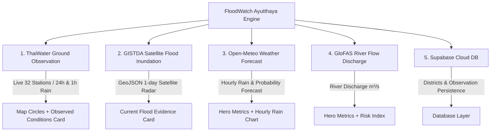

# FloodWatch Ayutthaya - AI & Developer Handover Guide

> **Core Philosophy**:  
> `Forecast (พยากรณ์) ≠ Observed Actuals (ค่าตรวจวัดจริง) ≠ Flood Risk (ความเสี่ยงน้ำท่วม) ≠ Flood Event (เหตุการณ์น้ำท่วมจริง)`  
> **Never mix or substitute these distinct data dimensions.**

---

## 1. Project Overview & Tech Stack
- **Framework**: Next.js 15 (App Router), TypeScript, React 19
- **Mapping**: MapLibre GL (`components/FloodMap.tsx`) with GeoJSON boundaries (`public/data/ayutthaya-province.geojson` & `public/data/ayutthaya-districts.geojson`)
- **Database**: Supabase PostgreSQL (`lib/supabase.ts`)
- **Styling**: Modern CSS (`app/globals.css`), Tailwind CSS v4, Lucide React icons
- **Target Area**: Phra Nakhon Si Ayutthaya Province (16 Districts, Province Code: `14`)

---

## 2. The 4 Live Data Dimensions & Pipelines



### 1. Ground Rainfall Observation (ค่าตรวจวัดปริมาณฝนจริง)
- **Provider**: ThaiWater / Hydro-Informatics Institute (สสน. - HII)
- **Standard Spec**: [standard.thaiwater.net](https://standard.thaiwater.net/) (Standard ID: `A001.1` Resource `/Rainfall`)
- **Live Endpoint in App**: `GET /api/rainfall?provinceCode=14` (and `/api/rainfall-test`)
- **Operational Data Source**: `https://api-v3.thaiwater.net/api/v1/thaiwater30/public/thailand_main_rain?province_code=14`
- **Output Schema**: Returns 32 real observation stations across Ayutthaya with exact Lat/Long, 24h cumulative rain (mm), 1h rain (mm), Station Name (TH/EN), Amphoe, Tumbon, and Basin. Standardized to official ThaiWater `timeSeriesObservation` schema.

### 2. Confirmed Flood Inundation (หลักฐานพื้นที่น้ำท่วมขังจากดาวเทียม)
- **Provider**: GISTDA Disaster Platform (FloodCheck)
- **Live Endpoint in App**: `GET /api/flood-event?lat={lat}&lon={lon}`
- **Operational Source**: `https://api-gateway.gistda.or.th/api/2.0/resources/features/flood/1day`
- **Requires Secret**: `GISTDA_API_KEY` (injected server-side via `API-Key` header)
- **Behavior**: Returns `evidence` if satellite radar detects flood water within 24 hours, `no_evidence` if no flood detected, or `unavailable` if API is offline or key missing.

### 3. Weather & Rainfall Forecast (พยากรณ์อากาศและฝนล่วงหน้า)
- **Provider**: Open-Meteo Weather API
- **Live Endpoint in App**: `GET /api/weather?lat={lat}&lon={lon}`
- **Source**: `https://api.open-meteo.com/v1/forecast`
- **Data**: 3-day forecast, hourly precipitation (mm), precipitation probability (%), temperature, humidity, wind speed.

### 4. River Discharge Flow Model (แบบจำลองการระบายน้ำของแม่น้ำ)
- **Provider**: Open-Meteo Flood API / GloFAS (Global Flood Awareness System)
- **Live Endpoint in App**: `GET /api/flood?lat={lat}&lon={lon}`
- **Source**: `https://flood-api.open-meteo.com/v1/flood`
- **Data**: Daily modelled river discharge ($m^3/s$). Used strictly as flow context, NOT as direct ground truth.

### 5. Database & Persistence Layer
- **Provider**: Supabase PostgreSQL
- **Endpoint**: `GET /api/supabase/health`
- **Client**: `lib/supabase.ts` (configured with `NEXT_PUBLIC_SUPABASE_URL` and `NEXT_PUBLIC_SUPABASE_PUBLISHABLE_KEY`)

---

## 3. UI Component Architecture

```
app/
├── api/
│   ├── rainfall/route.ts       # ThaiWater live 32-station rainfall pipeline & standardizer
│   ├── rainfall-test/route.ts  # Diagnostic & test endpoint
│   ├── flood-event/route.ts    # GISTDA FloodCheck 1-day satellite inundation route
│   ├── flood/route.ts          # Open-Meteo GloFAS river discharge route
│   ├── weather/route.ts        # Open-Meteo hourly weather forecast route
│   └── supabase/health/route.ts # Supabase PostgreSQL healthcheck
├── page.tsx                    # Main Dashboard page (Language, District state, Data orchestration)
├── layout.tsx                  # Root HTML shell & viewport
components/
└── FloodMap.tsx                # MapLibre GL map with boundaries + ThaiWater circle overlays
lib/
├── districts.ts                # 16 Ayutthaya districts and coordinate centers
├── i18n.ts                     # Bilingual (TH / EN) dictionary and localization
└── supabase.ts                 # Supabase client singleton & configuration guard
```

---

## 4. Map Overlays & Color Coding (`components/FloodMap.tsx`)
The 32 ThaiWater stations are passed as a GeoJSON `FeatureCollection` point overlay to `<FloodMap overlays={mapOverlays} />`:
- 🔵 **Cyan (`#06b6d4`)**: Light rain `< 10 mm`
- 🟡 **Yellow (`#eab308`)**: Moderate rain `10 - 35 mm`
- 🟠 **Orange (`#f97316`)**: Heavy rain `35 - 90 mm`
- 🔴 **Red (`#ef4444`)**: Very heavy rain `> 90 mm`

---

## 5. Environment Variables (`.env.local`)

```bash
# GISTDA Disaster Platform (Required for satellite flood inundation)
GISTDA_API_KEY=your_gistda_api_key_here

# Supabase Cloud Database (Required for database access)
NEXT_PUBLIC_SUPABASE_URL=https://your-project.supabase.co
NEXT_PUBLIC_SUPABASE_PUBLISHABLE_KEY=your_publishable_anon_key_here

# Optional: Custom ThaiWater API Base URL (defaults to HII live service)
# THAIWATER_API_BASE_URL=https://...
# THAIWATER_API_KEY=your_thaiwater_token_here
```

---

## 6. Critical Rules for Future AI / Developers
1. **NO FAKE / MOCK DATA**: Always use real upstream APIs or return explicit `unavailable` status.
2. **DISTINCTION INTEGRITY**: Do not conflate Rainfall (ฝน) with Flood Inundation (น้ำท่วมขัง). A heavy rain does not always mean confirmed flooding, and a flood from upstream discharge may occur with zero local rainfall.
3. **NEVER EXPOSE KEYS**: Keep `GISTDA_API_KEY` and any private tokens strictly inside Next.js server route handlers. Never leak them into client bundles.
4. **BILINGUAL SUPPORT**: Always provide translations in both Thai (`th`) and English (`en`) inside `lib/i18n.ts`.

<!-- BEGIN:nextjs-agent-rules -->

# This is NOT the Next.js you know

This version has breaking changes — APIs, conventions, and file structure may all differ from your training data. Read the relevant guide in `node_modules/next/dist/docs/` (resolved from this file's directory; in monorepos the `next` package may not be visible from the repo root) before writing any code. Heed deprecation notices.

This block is written and re-added by `next dev` — verify at `node_modules/next/dist/server/lib/generate-agent-files.js`. Removing it from a diff only re-creates the uncommitted change; committing it with your work keeps the tree clean.

<!-- END:nextjs-agent-rules -->
